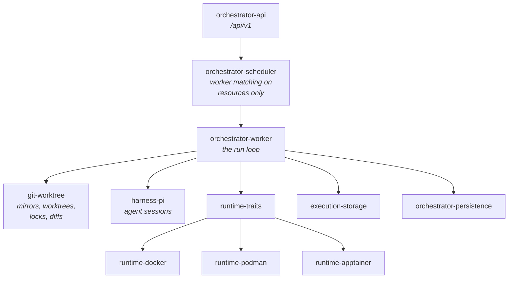
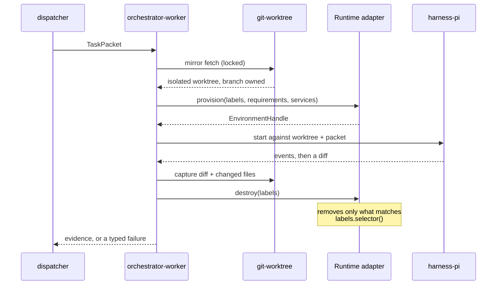
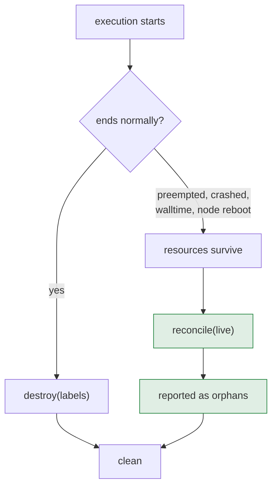
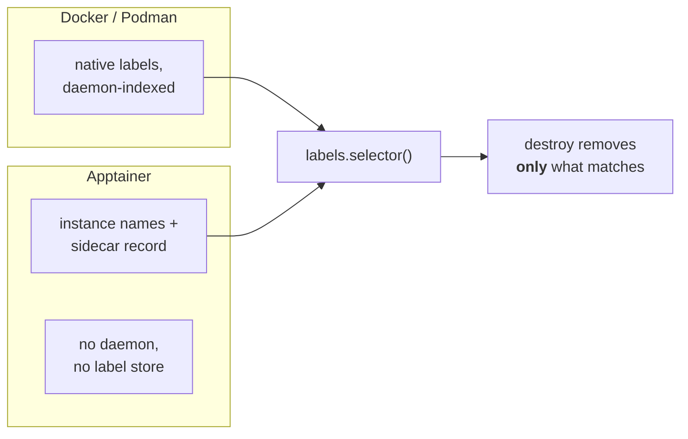
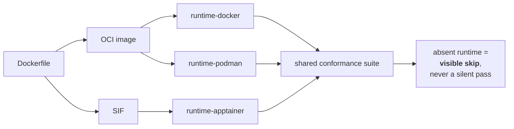
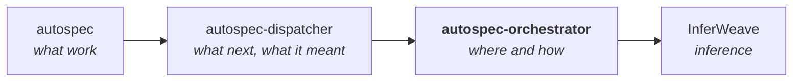

# The execution plane, in diagrams

This plane answers one question: **where and how does work execute?** It never
decides *what* should run (control plane) or *what a result meant* (dispatch
plane).

## Crate responsibilities

`runtime-traits` carries the rule that makes the adapters swappable:

> Nothing above this trait may know which runtime is in use.

## One execution, with guaranteed cleanup

## Cleanup is guaranteed by reconcile, not by destroy

A preempted job never reaches `destroy`. On Slurm that is not an edge case —
GPU workers live in the preemptible partition, so eviction is the expected end
of a job, not an anomaly.

Green is the guarantee. `destroy` is the fast path; `reconcile` is what makes
cleanup true. It follows that `reconcile` must rebuild ownership from the
runtime's own listing — a sidecar state file may be gone while the instances it
described are not.

## Ownership differs by runtime, behaviour does not

Limits diverge the same way: Docker and Podman enforce them; unprivileged
Apptainer on HPC cannot, so the allocation does. An adapter must **report**
limits it cannot enforce rather than silently accept them.

## One image definition, every runtime

Because the SIF is generated from the same Dockerfile, container content is
identical across runtimes and the suite needs no per-runtime fixture. Slurm has
no Docker, so a suite that *requires* a Docker daemon can never run where this
code executes.

## Where this sits

